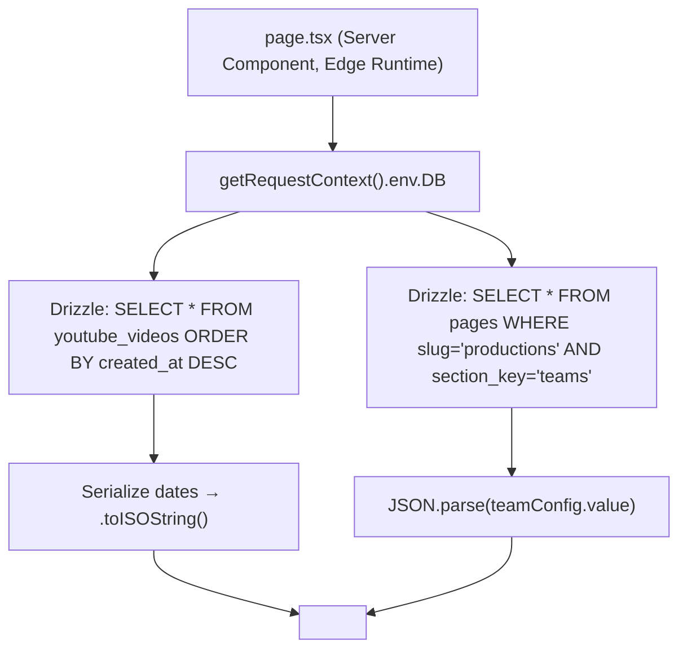
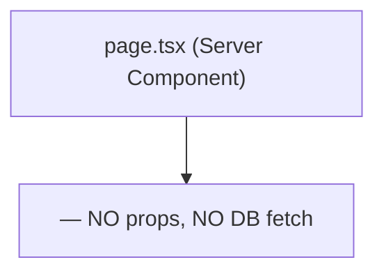
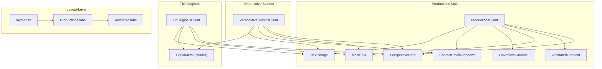
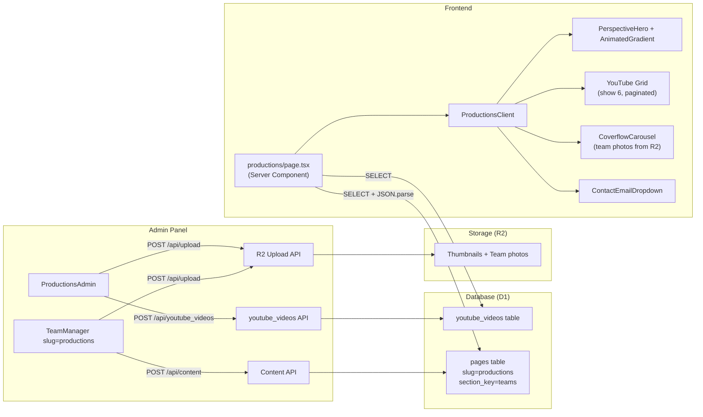

# 24-08-26

# Verspektive Productions — Technical Specification Document

> Scope: Every file, component, data path, animation, and API endpoint that powers `/productions` and its sub-routes.

---

## 1. Technology Stack

| Layer | Technology | Version |
|---|---|---|
| Framework | Next.js (App Router) | 16.3.0 |
| Runtime | Cloudflare Workers (Edge) | `@cloudflare/next-on-pages` 1.13.16 |
| Language | TypeScript | 5.x |
| Styling | Tailwind CSS v4 + PostCSS | 4.x |
| Animations | Framer Motion | 13.1.0 |
| Shaders | `@paper-design/shaders-react` (LiquidMetal) | 0.0.80 |
| Database | Cloudflare D1 (SQLite) via Drizzle ORM | 0.45.2 |
| Object Storage | Cloudflare R2 (image uploads) | via `@aws-sdk/client-s3` |
| Validation | Zod | 4.4.3 |
| Icons | Lucide React | 1.31.0 |
| Fonts | Inter, Outfit (Google Fonts) | — |

---

## 2. Route & File Structure

```
src/app/productions/
├── layout.tsx                          ← Shared layout (metadata, ProductionsTabs, dark bg)
├── page.tsx                            ← Server Component — fetches videos + teams from D1
├── client-page.tsx                     ← Client Component — main Productions UI
├── tio-originals/
│   ├── page.tsx                        ← Server Component (static, no DB fetch)
│   └── client-page.tsx                 ← Client Component — Talk It Out + Taste It Out
└── verspektive-studios/
    ├── page.tsx                        ← Server Component (static, no DB fetch)
    └── client-page.tsx                 ← Client Component — Studio info + CTA
```

---

## 3. Rendering Pipeline (Server → Client)

### 3.1 `/productions` (Main Page)



**Props passed to client:**
```typescript
interface ProductionsClientProps {
  initialVideos: Video[];  // { id, title, youtube_url, thumbnail_url, created_at }
  teams?: any[];           // TeamRow[] from JSON in pages table
}
```

### 3.2 `/productions/tio-originals`



> [!WARNING]
> This page performs **zero database queries**. All episode content is hardcoded as `[1, 2, 3].map(...)` placeholders.

### 3.3 `/productions/verspektive-studios`


> [!WARNING]
> This page also has **no dynamic data**. All facilities and content are hardcoded strings.

---

## 4. Layout Wrapper

**File:** [layout.tsx](file:///d:/Projects/Vikhil%20anna/VerspeKtive/src/app/productions/layout.tsx)

```typescript
// Key behaviors:
// 1. Sets bg-black + text-white on the wrapping div
// 2. Injects an inline <style> forcing html/body background to black
// 3. Renders <ProductionsTabs /> as a fixed bottom navigation bar
// 4. Exports metadata: { title: "VerspeKtive Productions" }
```

The `<style dangerouslySetInnerHTML>` is a workaround to override the root layout's `bg-background` which defaults to white in light mode. This ensures no white flash on initial paint.

---

## 5. Component Architecture (Dependency Graph)



---

## 6. Component Deep-Dives

### 6.1 PerspectiveHero

**File:** [perspective-hero.tsx](file:///d:/Projects/Vikhil%20anna/VerspeKtive/src/components/ui/perspective-hero.tsx) (51 lines)

| Prop | Type | Description |
|---|---|---|
| `hero` | `ReactNode` | Content displayed in the sticky first viewport (logo, tagline) |
| `cover` | `ReactNode` | Full-bleed image that scrolls over the hero |
| `children` | `ReactNode` | Page body content rendered after the hero/cover |

**Scroll Animation Mechanics:**
- Creates a `200vh` tall scroll container with `useRef`
- `hero` layer: `sticky top-0`, scales from `1 → 0.8` as user scrolls
- `cover` layer: `relative`, scales from `0.8 → 1`, has `rounded-t-[2rem] md:rounded-t-[4rem]` for a card reveal effect
- Uses Framer Motion `useScroll({ target, offset })` + `useTransform` for GPU-accelerated transforms
- `children` render in a separate full-width `z-10` div after the scroll container

### 6.2 AnimatedGradient (WebGL Shader)

**File:** [animated-gradient.tsx](file:///d:/Projects/Vikhil%20anna/VerspeKtive/src/components/ui/animated-gradient.tsx) (563 lines)

- Used **only** on the main `/productions` hero
- Renders a `<canvas>` with a custom **WebGL2 fragment shader**
- Supports 6 named presets: `Prism` (default), `Lava`, `Plasma`, `Pulse`, `Vortex`, `Mist`
- Productions page uses the `Prism` preset (black + blue + white palette)
- Shader features: noise distortion, swirl iterations, pattern shapes (Checks/Stripes/Edge), configurable softness
- Animates at 60fps via `requestAnimationFrame` loop
- Auto-resizes via `ResizeObserver`
- Optional grain/noise overlay via `noise` prop

### 6.3 LiquidMetal (Paper Design Shader)

**Package:** `@paper-design/shaders-react`

- Used on **TIO Originals** and **Verspektive Studios** hero logos
- Applied as a **CSS mask** over the logo PNG — the shader fills the shape of the logo text
- Uses preset `liquidMetalPresets[2]` with `transform: scale(5)` to ensure full coverage
- The logo PNGs used as masks:
  - TIO Originals: `/TIO-01.png` (both Talk & Taste sections)
  - Studios: `/MFB LOGO wg.png`

### 6.4 MaskText (Word-by-Word Reveal)

**File:** [MaskText.tsx](file:///d:/Projects/Vikhil%20anna/VerspeKtive/src/components/MaskText.tsx) (44 lines)

- Splits `text` into words, wraps each in `overflow-hidden` container
- Each word animates `y: "100%" → "0"` when scrolled into view
- Uses `useInView({ once: true, margin: "-10%" })` for intersection detection
- Stagger: `delay: 0.05 * wordIndex`
- Easing: `[0.33, 1, 0.68, 1]` (custom cubic-bezier, ease-out feel)

### 6.5 CoverflowCarousel (Team Section)

**File:** [coverflow-carousel.tsx](file:///d:/Projects/Vikhil%20anna/VerspeKtive/src/components/ui/coverflow-carousel.tsx) (365 lines)

| Prop | Type | Default | Description |
|---|---|---|---|
| `slides` | `CoverflowSlide[]` | — | Array of `{ src, alt, title?, subtitle?, meta? }` |
| `rotate` | `number` | 44 | Max Y-rotation in degrees for side cards |
| `depth` | `number` | 0.6 | Z-translation multiplier |
| `perspective` | `number` | 3 | CSS perspective multiplier |
| `autoPlayDuration` | `number` | 0 | Auto-advance interval in ms (0 = disabled) |
| `loop` | `boolean` | true | Infinite scrolling |

**Interaction Model:**
- Pointer drag: captures `pointerId`, tracks velocity for momentum
- Keyboard: `ArrowLeft` / `ArrowRight`
- Touch: `pan-y` CSS touch-action (allows vertical scroll, captures horizontal)
- Settlement: eased spring via `remaining * 0.16` per frame (non-spring, linear damping)
- Auto-play pauses on hover (`isHovered` state)
- Cards use raw DOM transforms (`card.style.transform`) for performance — **not React state**, avoiding re-renders

### 6.6 ContactEmailDropdown

**File:** [ContactEmailDropdown.tsx](file:///d:/Projects/Vikhil%20anna/VerspeKtive/src/components/ContactEmailDropdown.tsx) (185 lines)

- Renders as a **portal** (`createPortal` to `document.body`) to escape overflow clipping
- Positioned via `getBoundingClientRect()` relative to trigger button
- Options: Open in Gmail, Open in Outlook, Open Default App (`mailto:`), Copy to clipboard
- Auto-closes on scroll, resize, or outside click
- Animated entry/exit via Framer Motion `AnimatePresence`

### 6.7 ProductionsTabs (Bottom Navigation)

**File:** [productions-tabs.tsx](file:///d:/Projects/Vikhil%20anna/VerspeKtive/src/components/productions-tabs.tsx) (57 lines)

Renders context-aware floating tab bar at `fixed bottom-6`:

| Current Route | Tabs Shown | Back Button |
|---|---|---|
| `/productions` | "TIO Originals", "VerspeKtive Studios" | Hidden (at root) |
| `/productions/tio-originals` | "Talk it out" `#talk-it-out`, "Taste it out" `#taste-it-out` | → `/productions` |
| `/productions/verspektive-studios` | "VerspeKtive Studios" (single) | → `/productions` |

**Hash-based Active State (TIO Originals):**
- TIO Originals page dispatches `CustomEvent("updateActiveHash")` from an `IntersectionObserver`
- The observer watches `#talk-it-out` and `#taste-it-out` sections with `rootMargin: "-40% 0px -40% 0px"`
- `ProductionsTabs` listens for both `hashchange` and `updateActiveHash` events
- Active tab pill animates position via CSS `transition-all duration-500`

### 6.8 AnimatedTabs (Generic Tab Component)

**File:** [animated-tabs.tsx](file:///d:/Projects/Vikhil%20anna/VerspeKtive/src/components/ui/animated-tabs.tsx) (114 lines)

- Floating pill indicator that slides between tabs using `offsetLeft` + `offsetWidth`
- Active pill doubles as a **back button** (chevron-left) when on a sub-page
- Supports both route-based (`href="/..."`) and hash-based (`href="#..."`) tabs
- `grouped` prop merges adjacent tabs visually (shared background, rounded only on edges)

---

## 7. Database Schema

### 7.1 `youtube_videos` Table

**File:** [schema.ts](file:///d:/Projects/Vikhil%20anna/VerspeKtive/src/db/schema.ts#L28-L34)

```sql
CREATE TABLE youtube_videos (
  id         INTEGER PRIMARY KEY AUTOINCREMENT,
  title      TEXT    NOT NULL,
  youtube_url    TEXT NOT NULL,
  thumbnail_url  TEXT NOT NULL,
  created_at INTEGER NOT NULL  -- Unix timestamp, Drizzle mode: "timestamp"
);
```

### 7.2 `pages` Table (Teams JSON Storage)

**File:** [schema.ts](file:///d:/Projects/Vikhil%20anna/VerspeKtive/src/db/schema.ts#L3-L10)

```sql
CREATE TABLE pages (
  id           INTEGER PRIMARY KEY AUTOINCREMENT,
  slug         TEXT NOT NULL,        -- e.g., "productions"
  section_key  TEXT NOT NULL,        -- e.g., "teams"
  content_type TEXT NOT NULL,        -- "text" | "richtext" | "image_url" | "json"
  value        TEXT NOT NULL,        -- Raw string or JSON-serialized data
  updated_at   INTEGER NOT NULL      -- Unix timestamp
);
```

**Teams JSON Structure** (stored in `pages.value` where `slug="productions"` and `section_key="teams"`):

```typescript
interface TeamMember {
  id: string;    // Timestamp-based unique ID
  src: string;   // R2 image URL
}

interface TeamRow {
  id: string;        // Timestamp-based unique ID
  title: string;     // e.g., "Production Team", "Creative Team"
  duration: number;  // Auto-play interval in ms (0 = disabled)
  members: TeamMember[];
}

// pages.value = JSON.stringify(TeamRow[])
```

---

## 8. API Contracts

### 8.1 `GET /api/youtube_videos`

| | Details |
|---|---|
| Auth | Public (no session check) |
| Runtime | Edge |
| Response | `{ data: Video[] }` ordered by `created_at DESC` |
| Error | `{ error: string }` with status 500 |

### 8.2 `POST /api/youtube_videos`

| | Details |
|---|---|
| Auth | Session required (`getSession()`) |
| Validation | Zod: `title` (1-500 chars), `youtube_url` (HTTPS), `thumbnail_url` (HTTPS) |
| Body | `{ title, youtube_url, thumbnail_url }` |
| Response | `{ success: true }` |

### 8.3 `DELETE /api/youtube_videos?id=<int>`

| | Details |
|---|---|
| Auth | Session required |
| Validation | Zod: `id` must be positive integer |
| Response | `{ success: true }` |

### 8.4 `GET /api/content?slug=productions`

| | Details |
|---|---|
| Auth | Public |
| Validation | Zod: slug must match `/^[a-z0-9][a-z0-9\-_]{0,98}[a-z0-9]$/` |
| Response | `{ data: PageRow[] }` — all rows for that slug |

### 8.5 `POST /api/content` (Upsert)

| | Details |
|---|---|
| Auth | Session required |
| Validation | Zod: slug, section_key (same regex), value (max 50KB) |
| Body | `{ slug, section_key, content_type, value }` |
| Behavior | If row exists for `(slug, section_key)` → UPDATE, else INSERT |
| Response | `{ success: true }` |

### 8.6 `POST /api/upload` (R2 Image Upload)

| | Details |
|---|---|
| Auth | Session required (implied, shares admin context) |
| Body | `multipart/form-data` with `file` field |
| Response | `{ success: true, url: "https://..." }` — public R2 URL |

---

## 9. Admin CMS Panel

**File:** [page.tsx](file:///d:/Projects/Vikhil%20anna/VerspeKtive/src/app/admin/(protected)/page.tsx)

### 9.1 Productions Tab (`ProductionsAdmin` component, lines 432-611)

**YouTube Video Manager:**
- Fetches existing videos via `GET /api/youtube_videos` on mount
- Add form: title + YouTube URL + R2 thumbnail upload
- Delete: confirmation dialog → `DELETE /api/youtube_videos?id=X`
- Displays grid of existing videos with thumbnail preview

**Team Manager:**
- Renders `<TeamManager slug="productions" />` at the bottom
- Loads teams from `GET /api/content?slug=productions` → parses `teams` section_key
- UI: Add team rows, set title + auto-play duration, upload member photos to R2
- Saves serialized JSON back via `POST /api/content`

### 9.2 Other Relevant Admin Tabs

| Tab | Component | Team Manager Slug |
|---|---|---|
| Studios | `StudiosAdmin` | None (❌ missing) |
| Talk It Out | `TalkItOutAdmin` | `talk-it-out` |
| Taste It Out | `TasteItOutAdmin` | `taste-it-out` |

---

## 10. Navbar Integration

**File:** [navbar.tsx](file:///d:/Projects/Vikhil%20anna/VerspeKtive/src/components/navbar.tsx)

**Productions-specific behaviors:**

1. **Theme Toggler**: The `<AnimatedThemeToggler>` component **only renders** when `pathname.startsWith("/productions")` (line 202-206)
2. **Dark Mode Enforcement**: When on productions pages, navbar forces dark mode on `<html>` unless user explicitly set light (lines 125-137)
3. **Mega Menu**: Productions has 3 columns:
   - **Explore**: Talk It Out, Taste It Out, Verspektive Studios
   - **Quick Links**: About (`#about`), Contact Us (`#contact`)
   - **Social**: YouTube, Instagram

> [!CAUTION]
> **Broken Mega Menu Links**: The navbar links point to `/productions/talk-it-out` and `/productions/taste-it-out`, but these routes **do not exist** as standalone pages. The actual route is `/productions/tio-originals` with hash anchors `#talk-it-out` and `#taste-it-out`.

---

## 11. Static Asset Inventory

| Asset | Used By | File Size |
|---|---|---|
| `/555-01.png` | Main Productions hero logo | 121 KB |
| `/TIO-01.png` | TIO Originals hero (both Talk & Taste masks) | 12 KB |
| `/MFB LOGO wg.png` | Verspektive Studios hero mask | 91 KB |
| `/Productions screenshot.png` | Instagram section on main page | 6.2 MB ⚠️ |
| `/VB-01.svg` | Navbar logo | 0.6 KB |
| `/VerspeKtive White Word-01.png` | Home page hero | 101 KB |

**External Images (Unsplash, unoptimized):**

| URL | Used On |
|---|---|
| `photo-1598899134739-24c46f58b8c0` | Productions cover, TIO Talk cover |
| `photo-1555939594-58d7cb561ad1` | TIO Taste cover (food image) |
| `photo-1598488035139-bdbb2231ce04` | Studios cover (audio equipment) |

> [!WARNING]
> `next.config.ts` has `images.unoptimized: true`, meaning **no Next.js Image Optimization**. The 6.2 MB Instagram screenshot is served at full resolution to all devices.

---

## 12. Sections Breakdown by Page

### 12.1 `/productions` (Main Page)

| # | Section | ID | Data Source | Status |
|---|---|---|---|---|
| 1 | Hero (logo + tagline) | — | Hardcoded + `AnimatedGradient` | ✅ Complete |
| 2 | Cover (scroll reveal) | — | Unsplash image | ✅ Complete |
| 3 | About Us | `#about` | Hardcoded text | ✅ Complete |
| 4 | Our Services | — | Hardcoded array (4 items) | ✅ Complete |
| 5 | YouTube Showcase | — | `youtube_videos` DB table | ✅ Dynamic |
| 6 | Team Section | — | `pages` DB table (JSON) | ✅ Dynamic |
| 7 | Instagram Follow | — | Hardcoded link + screenshot | ✅ Complete |
| 8 | CTA (Contact) | `#contact` | `ContactEmailDropdown` | ✅ Complete |

### 12.2 `/productions/tio-originals`

| # | Section | ID | Data Source | Status |
|---|---|---|---|---|
| 1 | Talk It Out Hero | — | LiquidMetal shader + `/TIO-01.png` | ✅ Complete |
| 2 | Talk It Out Cover | — | Unsplash image | ✅ Complete |
| 3 | Talk It Out Episodes | `#talk-it-out` | **HARDCODED `[1,2,3]`** | ❌ Placeholder |
| 4 | Taste It Out Hero | — | LiquidMetal shader + `/TIO-01.png` | ✅ Complete |
| 5 | Taste It Out Cover | — | Unsplash food image | ✅ Complete |
| 6 | Taste It Out Episodes | `#taste-it-out` | **HARDCODED `[1,2,3]`** | ❌ Placeholder |

### 12.3 `/productions/verspektive-studios`

| # | Section | ID | Data Source | Status |
|---|---|---|---|---|
| 1 | Hero (logo + tagline) | — | LiquidMetal shader + `/MFB LOGO wg.png` | ✅ Complete |
| 2 | Cover | — | Unsplash studio image | ✅ Complete |
| 3 | Our Facilities | — | Hardcoded text | ✅ Complete |
| 4 | Features List | — | Hardcoded array (3 items) | ✅ Complete |
| 5 | Book the Studio CTA | `#contact` | `ContactEmailDropdown` | ✅ Complete |
| 6 | **Team Section** | — | **MISSING** | ❌ Not implemented |

---

## 13. Known Bugs & Issues

### 13.1 Critical — Broken Navigation Links

| Location | Broken Link | Should Be |
|---|---|---|
| [navbar.tsx](file:///d:/Projects/Vikhil%20anna/VerspeKtive/src/components/navbar.tsx#L31) mega menu | `/productions/talk-it-out` | `/productions/tio-originals#talk-it-out` |
| [navbar.tsx](file:///d:/Projects/Vikhil%20anna/VerspeKtive/src/components/navbar.tsx#L32) mega menu | `/productions/taste-it-out` | `/productions/tio-originals#taste-it-out` |
| [elastic-gallery.tsx](file:///d:/Projects/Vikhil%20anna/VerspeKtive/src/components/ui/elastic-gallery.tsx#L31) home gallery | `/studios` | `/productions/verspektive-studios` |
| [elastic-gallery.tsx](file:///d:/Projects/Vikhil%20anna/VerspeKtive/src/components/ui/elastic-gallery.tsx#L52) home gallery | `/tio-originals` | `/productions/tio-originals` |

### 13.2 Performance

- `/Productions screenshot.png` is **6.2 MB** — should be compressed or converted to WebP
- `images.unoptimized: true` in Next config disables all image optimization
- `AnimatedGradient` runs a WebGL `requestAnimationFrame` loop perpetually — no visibility-based pause

### 13.3 Type Safety

- Teams data is typed as `any[]` throughout the pipeline ([page.tsx](file:///d:/Projects/Vikhil%20anna/VerspeKtive/src/app/productions/page.tsx#L11) and [client-page.tsx](file:///d:/Projects/Vikhil%20anna/VerspeKtive/src/app/productions/client-page.tsx#L22))
- `team.members.map((m: any) => ...)` — no type assertion on deserialized JSON

### 13.4 UX

- TIO Originals page renders the **same logo** (`/TIO-01.png`) for both Talk and Taste sections — should differentiate
- Episode placeholders show "Episode 1", "Episode 2" with no content behind them
- Verspektive Studios uses `<div>` instead of `<motion.li>` for service items (inconsistent with Productions main page which uses animated list items)

---

## 14. Missing Features (Per Outline)

| Feature | Required By | Status |
|---|---|---|
| Dynamic Talk It Out episodes | TIO Originals page | ❌ Hardcoded placeholders |
| Dynamic Taste It Out episodes | TIO Originals page | ❌ Hardcoded placeholders |
| Team section for Studios page | Verspektive Studios | ❌ Not implemented |
| Team section for Productions (admin) | Admin CMS | ✅ Implemented (TeamManager) |
| Team section for Productions (frontend) | Productions client page | ✅ Implemented (CoverflowCarousel) |
| "1st Premium Podcast Studio in Tulunad" messaging | Outline spec | ✅ Present in hero tagline |
| Studio rentals (future) | Outline spec | ⏳ CTA exists, no booking system |

---

## 15. Data Flow Diagram (Complete)



---

## 16. CSS & Theme Handling

### Dark Mode Behavior
- Productions layout forces `bg-black text-white` at the wrapper level
- Navbar adds/removes `.dark` class on `<html>` based on route:
  - **On `/productions/*`**: defaults to dark mode, respects user toggle
  - **Off `/productions/*`**: forces light mode (`document.documentElement.classList.remove("dark")`)
- `AnimatedThemeToggler` only renders within productions routes

### Key CSS Variables (from globals.css, Tailwind v4)
```css
/* Light mode (default) */
--background: oklch(1 0 0);
--foreground: oklch(0.145 0 0);

/* Dark mode (.dark class) */
--background: oklch(0.145 0 0);
--foreground: oklch(0.985 0 0);
```

### Scrollbar
- Productions sub-pages use `dark-page-scrollbar` class for styled dark scrollbar on Webkit browsers

---

## 17. SEO Metadata

| Route | Title | Description |
|---|---|---|
| `/productions` | "VerspeKtive Productions" | Set in layout.tsx |
| `/productions/tio-originals` | "TIO Originals \| VerspeKtive Productions" | Set in page.tsx |
| `/productions/verspektive-studios` | "VerspeKtive Studios \| VerspeKtive Productions" | Set in page.tsx |

> [!NOTE]
> No `<meta name="description">` is set for any productions page. Only the root layout has a description ("Premium storytelling, from studio to screen.").
